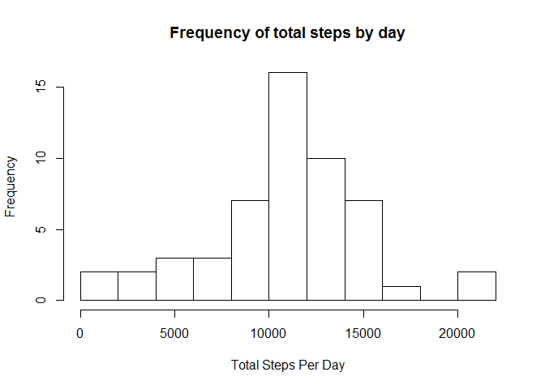
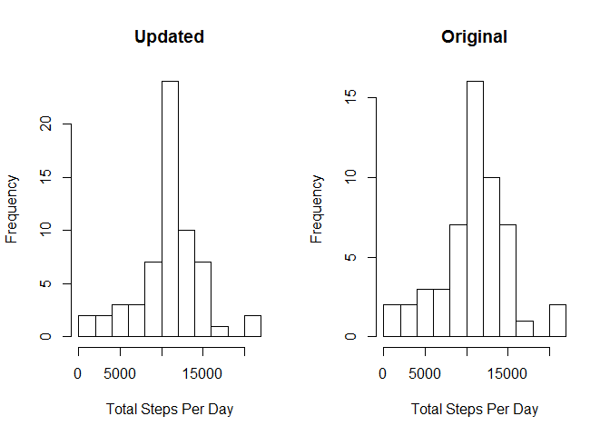

# Reproducible Research: Peer Assessment 1
Completed by Seth Cooper, September 2015

## Loading and preprocessing the data
The following code downloads activity.zip (also available in this repository), unzips the file  
and loads the table 'activity' to R.


```r
if(!file.exists("./data")){dir.create("./data")}
fileURL="http://d396qusza40orc.cloudfront.net/repdata%2Fdata%2Factivity.zip"

download.file(fileURL, destfile="./data/activity.zip")
unzip("./data/activity.zip", overwrite=TRUE, exdir="./data")

activity<-read.csv("./data/activity.csv", na.strings="NA")
```

## What is mean total number of steps taken per day?

In order to get a sense for the data set here is:

1. A histogram to illustrate the distribution of total steps taken per day.  And,

```r
library(dplyr)
```

```
## 
## Attaching package: 'dplyr'
## 
## The following object is masked from 'package:stats':
## 
##     filter
## 
## The following objects are masked from 'package:base':
## 
##     intersect, setdiff, setequal, union
```

```r
activity_byDay<-group_by(activity, date)

totalActivityByDay<-summarize(activity_byDay, dailyTotal = sum(steps))

hist(totalActivityByDay$dailyTotal, xlab = "Total Steps Per Day", main = "Frequency of total steps by day", breaks = 10)
```

 

2. The mean (dailyMean) and median (dailyMedian) of the total steps taken per day.

```r
summarize(totalActivityByDay, dailyMean = mean(dailyTotal, na.rm = TRUE), dailyMedian = median(dailyTotal, na.rm = TRUE))
```

```
## Source: local data frame [1 x 2]
## 
##   dailyMean dailyMedian
## 1  10766.19       10765
```

## What is the average daily activity pattern?

The following time series plot illustrates the average number of steps by interval accross all days.

```r
#Group by 5 minute interval
activity_byInterval <- group_by(activity, interval)

avgActivity_byInterval <- summarize(activity_byInterval, avgSteps = mean(steps, na.rm = TRUE))
with(avgActivity_byInterval, plot(interval, avgSteps, type="l"))
```

 


The maximum average number of steps is 206.17 and occurs at interval 835:

```r
#arrange data by steps descending and get first record to show interval with max avg steps
arrange(avgActivity_byInterval, desc(avgSteps))[1,]
```

```
## Source: local data frame [1 x 2]
## 
##   interval avgSteps
## 1      835 206.1698
```


## Imputing missing values
Notice there are some missing values in the data. Specifically 2304 records of steps taken are missing.

```r
sum(is.na(activity$steps))
```

```
## [1] 2304
```

To complete the analysis fill the missing records with the average for the interval accross rest of the dataset.

```r
#merge interval grouped activity data with average by interval activity data
mergedActivity_byInterval <- merge(activity_byInterval, avgActivity_byInterval)

#check for missing data in steps variable
mergedActivity_byInterval <- mutate(mergedActivity_byInterval, naCheck = is.na(steps))

#segment complete data and incomplete data
completeActivity <- filter(mergedActivity_byInterval, !naCheck)
incompleteActivity <- filter(mergedActivity_byInterval, naCheck)

#select required fields for complete data
completeActivity <- select(completeActivity, interval, steps, date)

#select required fields for incomplete data, replacing missing steps field with avgSteps
incompleteActivity <- select(incompleteActivity, interval, steps = avgSteps, date)

#combine into new, complete dataset.
filledActivity <- rbind(completeActivity, incompleteActivity)
```

Now notice the differnce in distribution between the updated data and the original.

```r
fullActivity_byDay <- group_by(filledActivity, date)

totalFilledActivityByDay<-summarize(fullActivity_byDay, dailyTotal = sum(steps))

par(mfrow = c(1,2))
hist(totalFilledActivityByDay$dailyTotal, xlab = "Total Steps Per Day", main = "Updated", breaks = 10)
hist(totalActivityByDay$dailyTotal, xlab = "Total Steps Per Day", main = "Original", breaks = 10)
```

 

as well as the difference between the update mean and median:

```r
summarize(totalFilledActivityByDay, dailyMean = mean(dailyTotal, na.rm = TRUE), dailyMedian = median(dailyTotal, na.rm = TRUE))
```

```
## Source: local data frame [1 x 2]
## 
##   dailyMean dailyMedian
## 1  10766.19    10766.19
```

and the original

```r
summarize(totalActivityByDay, dailyMean = mean(dailyTotal, na.rm = TRUE), dailyMedian = median(dailyTotal, na.rm = TRUE))
```

```
## Source: local data frame [1 x 2]
## 
##   dailyMean dailyMedian
## 1  10766.19       10765
```

By filling in the missing data the median and mean are now equal.  Whereas with the original dataset the median was slightly lower than the mean.

## Are there differences in activity patterns between weekdays and weekends?
To investigate, first add field to indicate whether a day is weekday or weekend:

```r
library(lubridate)

#create weekday field
filledActivity <- mutate(filledActivity, dow = weekdays(ymd(date)))

#assign factor levels absed on weekday
filledActivity <- mutate(filledActivity, isWD = ifelse(dow %in% c("Saturday", "Sunday"), "Weekend", "Weekday"))
filledActivity <- mutate(filledActivity, isWD = factor(isWD, levels=c("Weekend", "Weekday")))
```

Then plot activity for weekdays and weekends:

```r
#group by interval
filledActivity_byInterval <- group_by(filledActivity, interval)

#create graphs
par(mfrow= c(2,1))
with(summarize(subset(filledActivity_byInterval, isWD == "Weekend"), avgSteps = mean(steps)), plot(interval, avgSteps, main = "Weekend", ylab = "Number of Steps", xlab = "Interval", type="l"))
with(summarize(subset(filledActivity_byInterval, isWD == "Weekday"), avgSteps = mean(steps)), plot(interval, avgSteps, main = "Weekday", ylab = "Number of Steps", xlab = "Interval", type="l"))
```

 

As you can see there are differences in activity between Weekends and Weekdays.  During the weekend there is more activity spread throughout the day.  Whereas during the weekdays there is activity in the morning and then less the rest of the day.  


